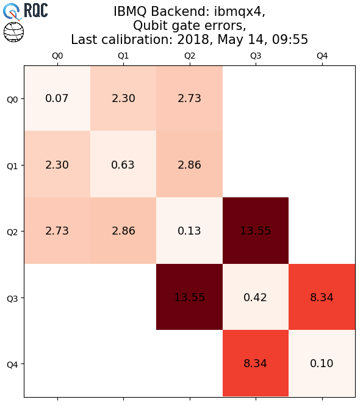
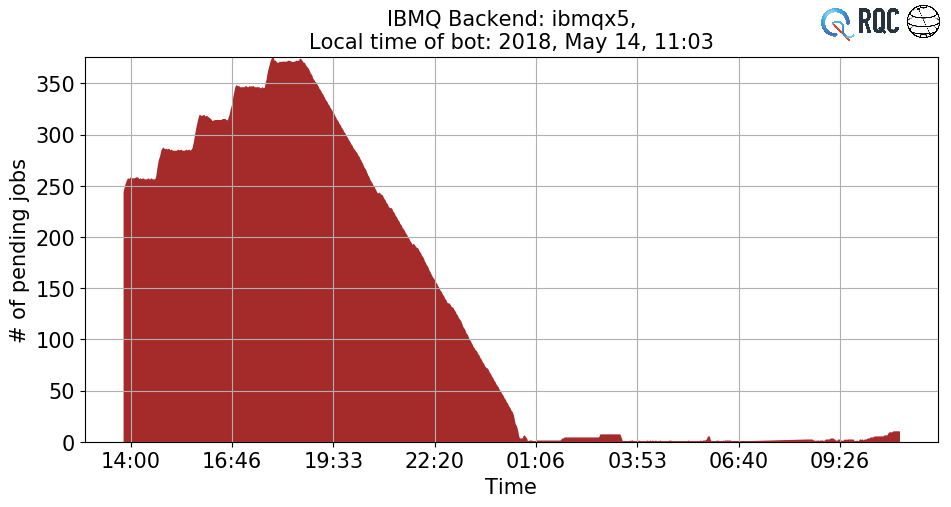
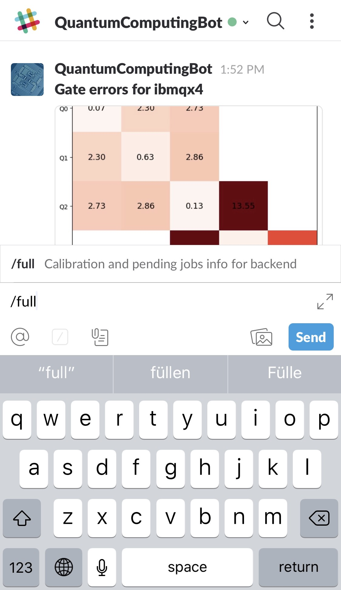
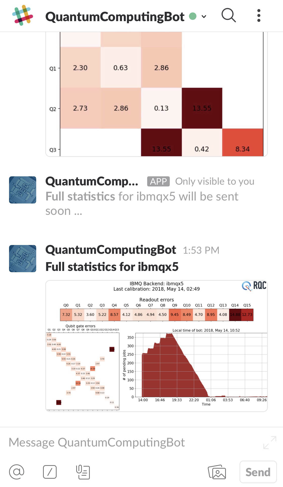
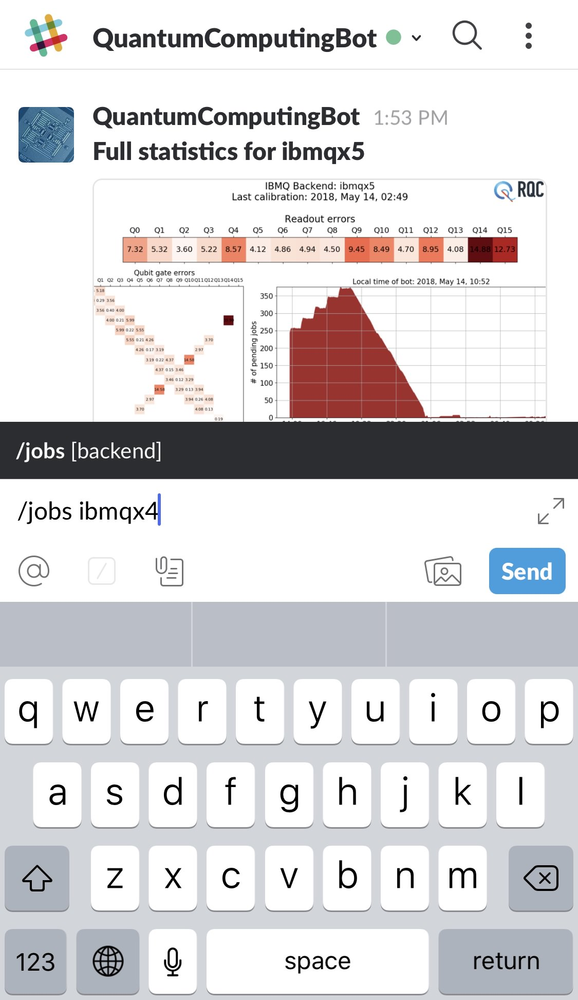
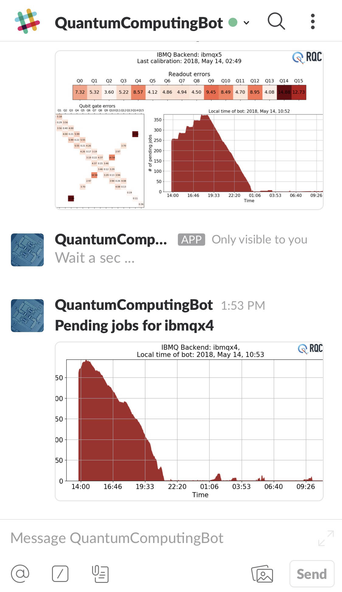
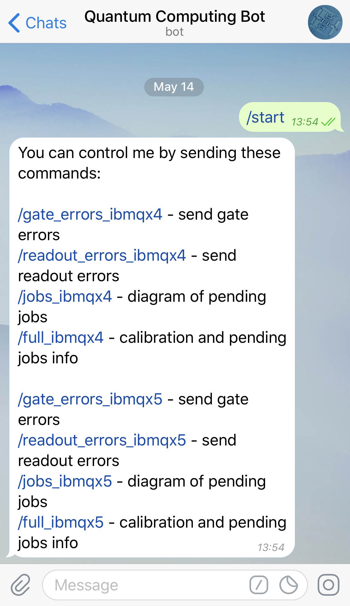
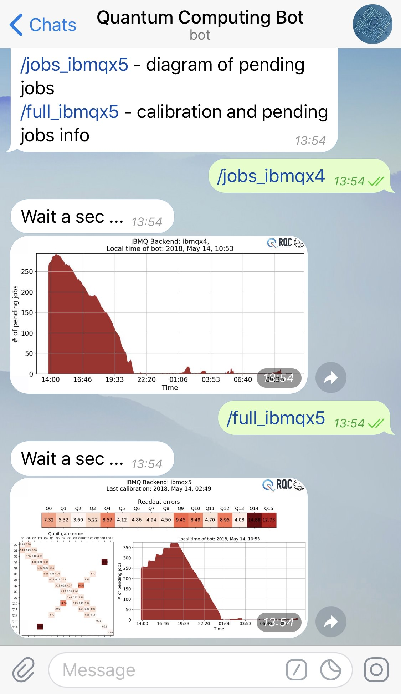

# QuantumComputingBot 

Monitoring the load of IBM Q processors from [IBM Quantum Experience](https://quantumexperience.ng.bluemix.net) (data for 24 hours).

| Calibration for [IBM QX 4](https://github.com/QISKit/ibmqx-backend-information/tree/master/backends/ibmqx4/V1) | Pending jobs for [IBM QX 5](https://github.com/QISKit/ibmqx-backend-information/blob/master/backends/ibmqx5/README.md)     |
| :------------- | :------------- |
|        |        |

### Bot for Slack

Bot is already available inside [QISKit](https://qiskit.org) workspace in [Slack](https://slack.com).

Bot understands the following commands:

* `/full [backend]` - calibration and pending jobs info for backend
* `/gate_errors [backend]` - send gate errors
* `/jobs [backend]` - diagram of pending jobs
* `/readout_errors [backend]` - send readout errors

`backend` is the name for quantum processors like [ibmqx4](https://github.com/QISKit/ibmqx-backend-information/tree/master/backends/ibmqx4/V1) or [ibmqx5](https://github.com/QISKit/ibmqx-backend-information/blob/master/backends/ibmqx5/README.md).

| Step 1 | Step 2 | Step 3 |
| :-------------: | :-------------: | :-------------: |
|        |        |        |

| Pass backend as argument - 1 | Pass backend as argument - 2 |
| :-------------: | :-------------: |
|        |        |


### Bot for Telegram

You can try it here on [Telegram](https://telegram.org) -> [@QuantumComputingBot](https://t.me/QuantumComputingBot).

Bot understands the following commands:

* `/gate_errors_ibmqx4` - send gate errors
* `/readout_errors_ibmqx4` - send readout errors
* `/jobs_ibmqx4` - diagram of pending jobs
* `/full_ibmqx4` - calibration and pending jobs info

| Commands | Overview     |
| :-------------: | :-------------: |
|        |        |

## Description

Structure of the project:
```
...
├── main_slack.py          <- Slack bot.
├── main_telegram.py       <- Telegram bot.
├── main_dumper.py         <- Crawler that dumps statistics
|                             into pickled data.
├── utils.py               <- File with methods for plotting.
├── data                   <- Folder with pickled data.
│   ├── real_data_1.pkl
│   └── ...
├── img                    <- Images for this README.
│   ├── jobs_demo.jpg
│   └── ...
├── res                    <- Folder with different resource files
|   |                         including tokens for APIs.
│   ├── rqc.jpg
│   ├── token_q.json
│   └── ...
└── tmp                    <- Folder with generated plots.
    ├── ibmqx4_full.png
    └── ...
```


## Authors

🇦🇺🇷🇺[Yaroslav Kharkov](https://www.physics.unsw.edu.au/staff/yaroslav-kharkov) &lt;[y.kharkov@gmail.com](mailto:y.kharkov@gmail.com)&gt;, [Anton Karazeev](https://akarazeev.github.io) &lt;[a.karazeev@rqc.ru](mailto:a.karazeev@rqc.ru)&gt;

## Additional software

| Name | Description     |
| :------------- | :------------- |
| [QISKit](https://www.qiskit.org)   | Provides API to [IBM Q Experience](https://quantumexperience.ng.bluemix.net)  |
| [Slack Bot with Python](https://www.fullstackpython.com/blog/build-first-slack-bot-python.html) | Manual on [Slack](https://slack.com) bot creation  |
| [Python-Telegram-Bot](https://github.com/python-telegram-bot/python-telegram-bot)  | Package which helps a lot in [Telegram](https://telegram.org) bots creation  |
| [Matplotlib](https://github.com/matplotlib/matplotlib)   | Drawing of plots  |

Originated from https://github.com/akarazeevprojects/QuantumComputingBot 🙌🏻
