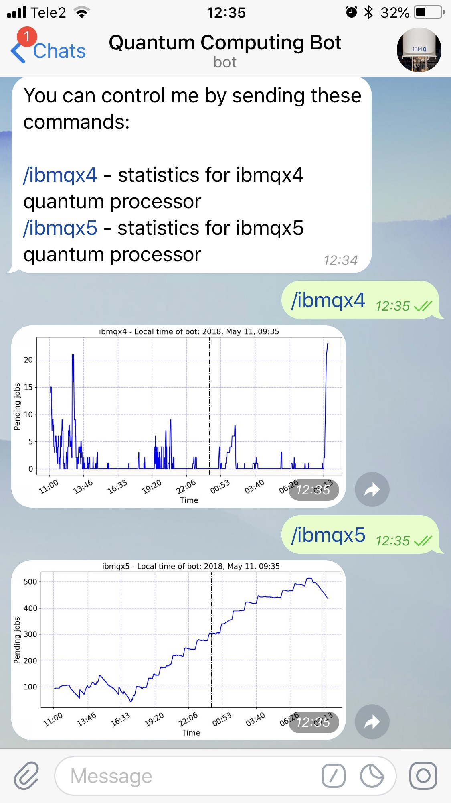
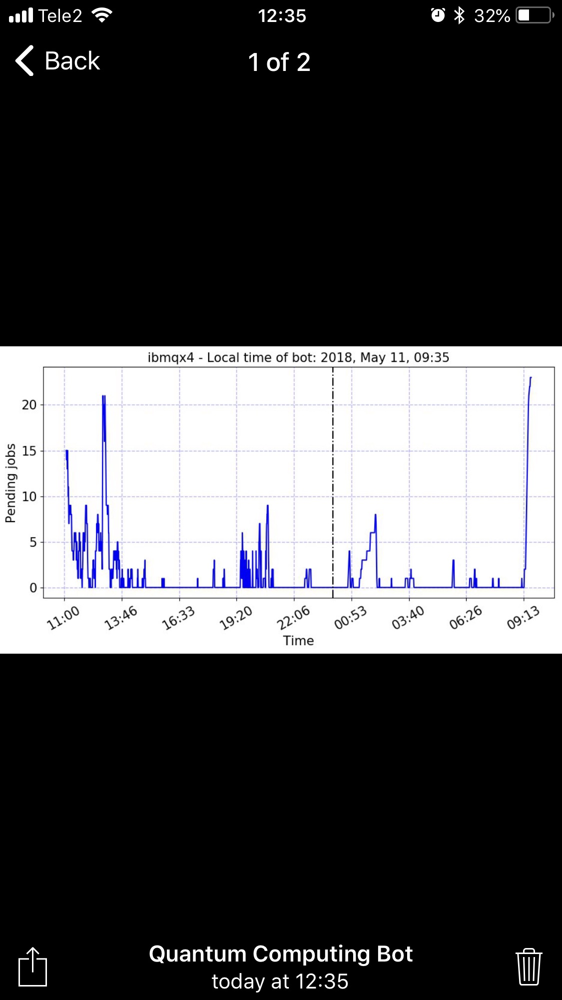

# [@QuantumComputingBot](https://t.me/QuantumComputingBot) 

Monitoring the load of IBM Q processors from [IBM Quantum Experience](https://quantumexperience.ng.bluemix.net).

You can try it here -> [@QuantumComputingBot](https://t.me/QuantumComputingBot).

| Overview | Statistics for ibmqx4 processor     |
| :------------- | :------------- |
|        |        |

## Description

Structure of the project:
```
├── LICENSE
├── README.md              <- This README.
|
├── main_slack.py          <- Slack bot.
├── main_telegram.py       <- Telegram bot.
├── main_dumper.py         <- Crawler that dumps statistics
|                             into pickled data.
├── utils.py               <- File with methods for plotting.
├── data                   <- Folder with pickled data.
│   ├── real_data_1.pkl
│   └── ...
├── img                    <- Images for this README.
│   ├── img1.jpg
│   └── ...
├── res                    <- Folder with different resource files
|   |                         including tokens for APIs.
│   ├── qiskit-logo.png
│   ├── rqc.jpg
│   ├── token_q.json
│   └── ...
└── tmp                    <- Folder with generated plots.
    ├── ibmqx4.png
    ├── ibmqx4_multiqubut_err.png
    └── ...
```


## Authors

[Yaroslav Kharkov](https://www.physics.unsw.edu.au/staff/yaroslav-kharkov) &lt;[y.kharkov@gmail.com](mailto:y.kharkov@gmail.com)&gt;, [Anton Karazeev](https://akarazeev.github.io) &lt;[a.karazeev@rqc.ru](mailto:a.karazeev@rqc.ru)&gt;

## Additional software

| Name | Description     |
| :------------- | :------------- |
| [QISKit](https://www.qiskit.org)   | Provides API to [IBM Q Experience](https://quantumexperience.ng.bluemix.net)  |
| [Slack Bot with Python](https://www.fullstackpython.com/blog/build-first-slack-bot-python.html) | Manual on [Slack](https://slack.com) bot creation  |
| [Python-Telegram-Bot](https://github.com/python-telegram-bot/python-telegram-bot)  | Package which helps a lot in [Telegram](https://telegram.org) bots creation  |
| [Matplotlib](https://github.com/matplotlib/matplotlib)   | Drawing of plots  |

Originated from https://github.com/akarazeevprojects/QuantumComputingBot 🙌🏻
